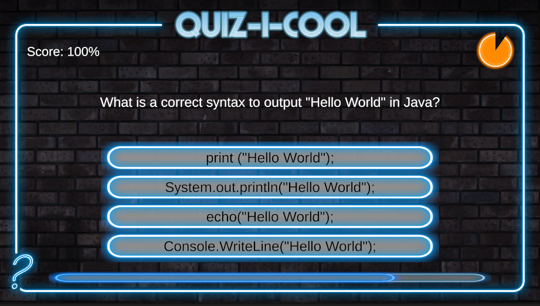

# Quizmaster

This 2D Game was created in Unity engine according to the course on Udemy.com

In this game, it is possible to answer pre-set questions that are randomly displayed. Only one answer out of four is always correct. According to the answered questions, the score is evaluated. The player always has 30 seconds to answer the question. After answering the question, the correct answer will be displayed. After answering all the questions, the game can be restarted with the button.

## Screenshoot

